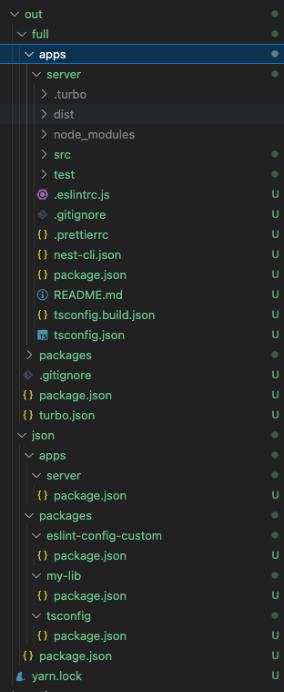

---
last_update:
  date: 2023-02-26
---

# 모노레포 도커 배포

[https://turbo.build/repo/docs/handbook/deploying-with-docker](https://turbo.build/repo/docs/handbook/deploying-with-docker)

도커에서도 터보레포와 비슷하게 빌드과정을 캐싱한다.

npm install은 캐싱되어 package.json 또는 packge-lock.json 이 변경되었을 때만 새로 설치된다. 모노레포 특성상 다른 워크스페이스의 패키지 설치로 전체 package-lock.json이 변경될 수 있는데 이러한 경우에는 도커의 npm install 캐싱이 무효화되기 때문에 큰 비효율을 초래함.

### 해결책

`turbo prune --scope="name" --docker` 명령어로 도커 이미지를 빌드할 앱과 의존성이 있는 내부 패키지들만 분리한 정리된 버전의 모노레포를 생성할 수 있다. 이 명령어의 결과물로 도커 이미지를 빌드하면 다른 워크스페이스의 변경에 영향을 받지 않는다.



위와 같은 결과물이 생긴다.

full은 소스파일까지 포함된 모노레포이고, json디렉토리는 package.json만 포함한다.

예시 Docekrfile

```docker
# This Dockerfile is copy-pasted into our main docs at /docs/handbook/deploying-with-docker.
# Make sure you update both files!

FROM node:alpine AS builder
# Check https://github.com/nodejs/docker-node/tree/b4117f9333da4138b03a546ec926ef50a31506c3#nodealpine to understand why libc6-compat might be needed.
RUN apk add --no-cache libc6-compat
RUN apk update
# Set working directory
WORKDIR /app
RUN yarn global add turbo
COPY . .
RUN turbo prune --scope=web --docker

# Add lockfile and package.json's of isolated subworkspace
FROM node:alpine AS installer
RUN apk add --no-cache libc6-compat
RUN apk update
WORKDIR /app
RUN yarn global add turbo

# First install the dependencies (as they change less often)
COPY .gitignore .gitignore
COPY --from=builder /app/out/json/ .
COPY --from=builder /app/out/yarn.lock ./yarn.lock
RUN yarn install

# Build the project
COPY --from=builder /app/out/full/ .
COPY turbo.json turbo.json

# Uncomment and use build args to enable remote caching
# ARG TURBO_TEAM
# ENV TURBO_TEAM=$TURBO_TEAM

# ARG TURBO_TOKEN
# ENV TURBO_TOKEN=$TURBO_TOKEN

RUN yarn turbo run build --filter=web...

FROM node:alpine AS runner
WORKDIR /app

# Don't run production as root
RUN addgroup --system --gid 1001 nodejs
RUN adduser --system --uid 1001 nextjs
USER nextjs

COPY --from=installer /app/apps/web/next.config.js .
COPY --from=installer /app/apps/web/package.json .

# Automatically leverage output traces to reduce image size
# https://nextjs.org/docs/advanced-features/output-file-tracing
COPY --from=installer --chown=nextjs:nodejs /app/apps/web/.next/standalone ./
COPY --from=installer --chown=nextjs:nodejs /app/apps/web/.next/static ./apps/web/.next/static
COPY --from=installer --chown=nextjs:nodejs /app/apps/web/public ./apps/web/public

CMD node apps/web/server.js
```

작업을 builder, installer, runner 세번으로 나눈 이유는 이렇게 하면 마지막 러너 이미지의 용량을 최소화 할 수 있기 때문이라고 한다. (builder, installer에는 불필요한 소스파일이 포함되어 있고 libc6-compat라는 패키지도 따로 설치함)

`docker build -f apps/web/Dockerfile .`

깃헙 액션에서 메인에 푸시할 때 도커 이미지 빌드시켜주면 될 듯.
