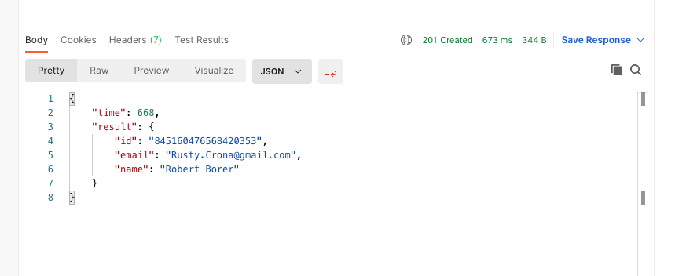
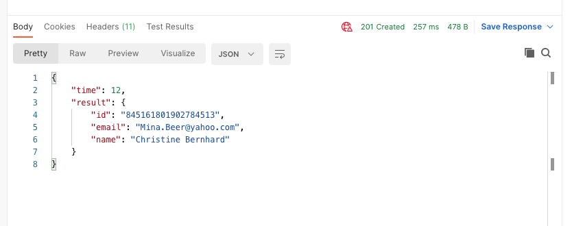

---
last_update:
  date: 2023-03-05
---

# 레이턴시 확인

일단 CockroachDB의 리전은 캘리포니아(us)로 설정했다.
아시아 리전으로 싱가포르가 있는데, 생각보다 싱가폴 핑이 한국에서 별로 좋지 않고 서양쪽에서는 너무 느릴 것 같아서 캘리포니아로 설정했다.
인터넷에서 본 핑테스트 결과는 싱가폴 120ms, 캘리포니아 180ms 정도였다.

로컬에서 한 번 확인해보고 fly.io로 서버도 띄워서 한 번 확인해봤다.
[fly.io](http://fly.io/) 서버도 물론 캘리포니아로 설정했다.

GET 요청은 캐싱 설정이 혹시나 있어서 잘못 측정될까봐 POST 요청으로 확인한다.

코드는 아래와 같다.

```tsx
@Post()
async createUser() {
  const start = Date.now();
  const result = await this.userService.createUser();
  return { time: Date.now() - start, result };
}
```

DB 요청이 끝나는 시간도 확인해서 서버 - DB 서버 간에 레이턴시도 기록했다.

`userService.createUser`는 faker 라이브러리로 임의로 이메일과 이름을 생성해서 유저를 만든다.

로컬



로컬에선 해보니까 7~800ms 정도 걸렸다.

서버가 로컬이니까 소요시간의 대부분은 당연히 디비서버로의 네트워크 대기시간이다.

fly.io서버 (캘리포니아 리전)



배포된 캘리포니아 서버의 경우 200~300ms정도 소요되었다.

같은 지역에 서버와 디비서버가 있으니까 db요청 처리 완료까지 12ms밖에 안걸린다.

로컬보다 레이턴시가 훨씬 줄었는데 캘리포니아에서 한국까지의 회선이 CockroachDB보다 fly.io에서 훨씬 좋은걸 쓰나보다 싶다.

그런데 이상한건 콜드스타트가 있다. CockroachDB는 원래 있는게 맞고, fly.io는 최소 인스턴스를 유지해서 없어야 할텐데 첫 요청시에 좀 늦게 반응한다. 그래도 못쓸 정도는 아니다.

생각보다 레이턴시가 낮다. 좋은듯. CockroachDB 서버리스 버전에도 멀티리전 준비하는 것 같던데 캘리포니아 리전으로 쓰다가 나중에 리전 추가해야겠다.
