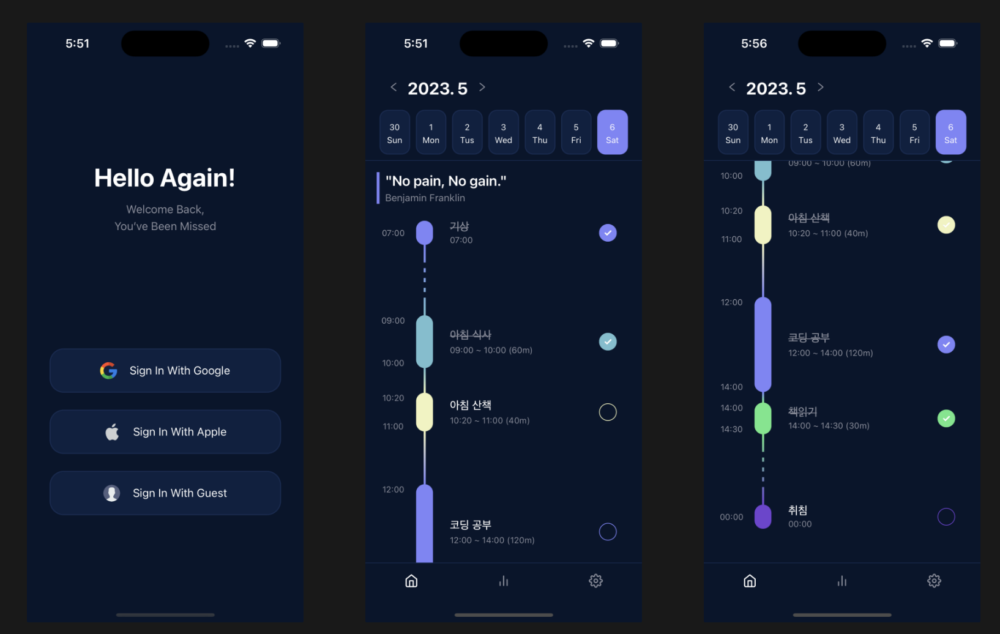

---
last_update:
  date: 2023-05-06
---

# 사이드 프로젝트 하다만 후기

최근 이런 캘린더앱을 만들다가 오늘 때려쳤다.

이유는 출시하면 망할 것 같은데 생각보다 고려할게 많아서 만들기도 빡세서다.

만들면서 느낀점이나 알게된 점들을 주저리 주저리 남긴다.

### 개성이 중요함

[https://structured.app/](https://structured.app/) 사실 이 어플리케이션을 보고 시작한건데, 해당 앱이 아직 안드로이드버전은 개발 중이라 내가 먼저 똑같이 개발해서 출시하면 비슷하게 성공할 수 있지 않을까?라는 막연한 생각으로 시작했다.

만들다보니 너무 범용적인 카테고리에서 별다른 개성 없는 기존앱들의 열화판을 만들고 있는 것 같다고 생각이 들었다. 캘린더앱은 Structured 앱이 아니더라도 이미 너무 많은 대형앱이 있는 카테고리다. 기존 앱과 비교해서 기능의 양적으론 뒤쳐져도 기존 앱에 없는 기능이 있어야 경쟁이 될텐데 그런게 없었다. 디자인은 옛날 앱들보다 나은 것 같은데 난 개발자라 디자인으로 쇼부 보는건 지속가능하지 않다고 생각했다.

그리고 너무 범용적인, 있는게 당연한 기능들만 개발하면 재미도 없다.

다음부턴 시장에 없는 기능이거나 아니면 아예 특이한 기능이 하나라도 있는 앱만 만든다.

### 초기 디자인은 돈으로 해결 가능

[https://ui8.net/](https://ui8.net/) 여기서 디자인 시스템이나 앱 화면을 피그마로 구현해서 판매한다. 저렴하진 않다.

디자인은 내가 시간을 붓는다고 해결할 수 있는 문제가 아니라서 위 사이트에서 피그마 파일을 사봤는데 좋았다. 전체적인 틀만 따라가면서 세부내용은 조금 수정해서 쓰는 정도는 나도 할 수 있었다.

디자인 시스템이나 다크모드 색상도 지정되어 있어서 개발하기 편하다. 실제 다크모드를 제대로 적용해본건 첨인데 사용하는 색상이 몇가지 안되다보니 생각보다 고민하거나 할게 거의 없었다. 색깔을 덜 쓰는게 디자인적으로 좋기도 해서 다크모드는 무조건 챙기는게 좋은 것 같다.

### 앱, 웹, mac, windows를 동시에 개발 가능함

[tamagui](https://tamagui.dev/) 라는 라이브러리로 rn과 웹 동시에 스타일링이 가능하다. 물론 안써도 react-native-web으로 포팅이 되는데 아마 tamagui없이 포팅하면 마크업 태그 속성없이 모두 div로 도배되어 있을 것이다.

[https://github.com/chen-rn/CUA](https://github.com/chen-rn/CUA) 와 같은 스타터도 좋아보인다.

웹으로 포팅이 되면 해당 웹을 electron이나 tauri로 띄울 수도 있다.

이번에 고민하다 tamagui는 사용하진 않았다.

### reanimated js 쓰레드 성능 이슈

reanimated 라이브러리를 사용해서 일정을 드래그앤 드랍으로 수정하도록 구현했다. 일정간에 간격이 균일하지 않아서 (일정길이 이상의 간격은 생략 조정이 생김) 드래그 중에 시간을 설정하려면 매번 해당위치에서 어느정도 시간값을 가지는지 계산이 필요했다. 

웹에서의 window.onscroll내에서 js로직을 실행하는 것 처럼 js 계산로직을 실행하니 애니메이션이 끝나고도 한참 동안 계산로직이 호출되었다. 결국 throttle 300ms 정도 걸어주니 해결되긴 했는데 모션에 대한 반응성이 너무 떨어지는 느낌이었다. 추측으론 계산 비용이 커서 ui스레드 애니메이션 속도에 js 스레드의 리스너가 따라가질 못하는 것 같다. 드래그 중일 때 실시간으로 계산하는건 지양해야 할 것 같다. 

### 디비 고민

드래그앤 드랍으로 일정을 수정하거나 일정 완료 처리때 마다 디비 수정이 필요하다. 난 서버 비용 아끼겠다고 미국 리전에 있는 서버랑 디비 쓰는데 한국에서 레이턴시가 대략 200ms ~ 300ms 정도 걸린다.

앱에 사소한 변경마다 로딩이 걸리면 사용성에 문제가 생길 것이다. 특히 다른 캘린더 앱은 보통 로딩이 전혀 없기에 더 부각된다. 결국 낙관적 업데이트로 잘 처리하거나 앱 로컬디비를 쓰고 주기적으로 서버 디비와 동기화하는 방법으로 해결해야 한다.

로딩없이 낙관적 업데이트로 해결하기에는 연속적으로 수정이 될 때 버그 생기기 너무 쉬워보였다. 로컬디비 서버 동기화도 해본적도 없고 유지보수하기 어려워 보인다. 여러 앱에서 동기화가 잘 안된다는 리뷰 심심찮게 봤는데 원격디비에 로컬디비 동기화하는게 쉽지 않은듯.

structured 앱은 icloud 써서 동기화를 한다. 좋은 방법인데 안드로이드와는 호환이 안되는게 아쉽다.

그냥 다음부턴 잦은 업데이트가 없는 앱을 만들어야겠다. 너무 고민할게 많다.

### 위젯은 결국 네이티브를 사용해야

캘린더 카테고리에서 위젯이 거의 필수적인데 찾아보니까 ios, 안드로이드 위젯을 만들려면 결국 네이티브 코드를 건드려야 한다.

### 인증은 firebase

supabase 기본 결제금액이 부담되고 clerk 같은 라이브러리는 너무 비싸다.

이것저것 찾아봤는데 어차피 ga때문에 firebase 설치하는데 인증도 firebase꺼 쓰는게 좋은 듯. 익명 로그인 지원되는 점도 좋다.

### 도메인, 유즈케이스

[https://github.com/soso01/daily-plan](https://github.com/soso01/daily-plan) 레포 주소

firebase 로그인이랑 캘린더 ui까지만 만들었다. 예전에 클린아키텍처 책 보고 앞으로 이렇게 이렇게 도메인이랑 유즈케이스 분리해서 구조 잡아야겠다고 생각한게 있었는데 다 까먹었다. 그래서 생각없이 하다보니 굉장히 근본없는 구조가 됨. 유즈케이스가 애매하다. 그냥 난 유틸함수 모음처럼 사용하는 것 같다.

그래도 간만에 재밌게 개발해서 좋았다. 다음엔 출시까지하자.

